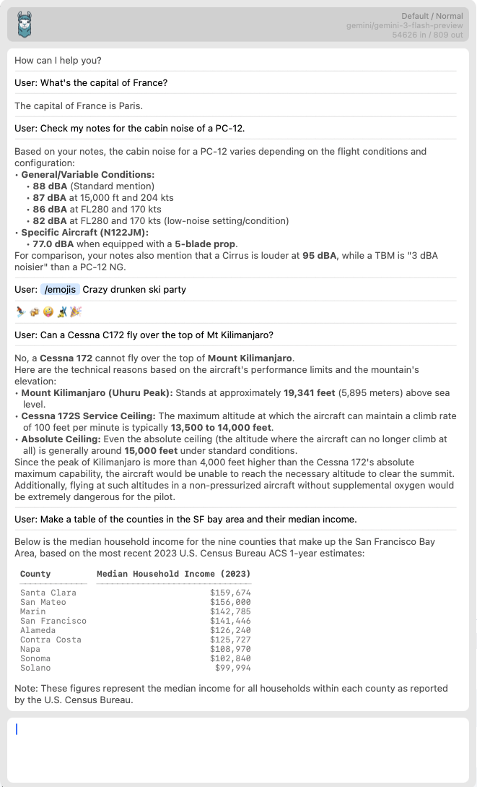

# macLLM - AI Agent for macOS

macLLM is a local AI agent for macOS, launched via a hotkey. It uses tools to answer questions, search the web, and work with your files. For example:

* "Can a Cessna C172S fly over Mt Kilimanjaro?" — searches the web and reasons on facts
* "Make a table of my families passport numbers" — searches your indexed notes or files, e.g. Obsidian
* "Check @~/Documents/proposal.md vs. @company.com/proposal.html — reads and processes files and URLs
* "/emojis Crazy drunken ski party" — picks relevant emojis
* "Summarize @clipboard and append to my note @~/Notes/skiholiday2026.md"

macLLM is:
* Open source (Apache 2.0)
* Very easily extensible. It's written in 100% Python and highly modular
* Has a native macOS Cocoa UI written in Python (via PyObjC)
* Agentic — uses [smolagents](https://github.com/huggingface/smolagents) with tool calling
* Model-agnostic via [LiteLLM](https://docs.litellm.ai/) (supports OpenAI, Gemini, Anthropic, and more)



## Installation

macLLM uses the [uv](https://github.com/astral-sh/uv) package manager. Install it first, then run:

```bash
uv run -m macllm
```

uv handles all dependencies automatically.

### API Keys

macLLM requires API keys for the LLM you want to use. Right now supported providers are:
* Google - Gemini flash is default
* OpenAI - good for complex tasks
* Inception Labs - ultra fast diffusion models)
Create a `.env` file in the project root or export environment variables:

| Variable | Required for | Provider |
|---|---|---|
| `GEMINI_API_KEY` | Default (`/normal`) | Google Gemini |
| `INCEPTION_API_KEY` | `/fast` speed | Inception Labs (Mercury) |
| `OPENAI_API_KEY` | `/slow` / `/think` speed | OpenAI (GPT-5) |
| `BRAVE_API_KEY` | Web search tool | Brave Search |

At minimum, set `GEMINI_API_KEY` to use the default model. Add `BRAVE_API_KEY` to enable web search.

## Basic Usage

Press the hotkey (default: **⌥ Space** / option-space) to open the window, then type a query:

> Capital of France?

After a moment you get the reply. From there you can:
1. Press **Escape** to close the window (the hotkey also toggles it).
2. Press **⬆** to browse the reply, then **⌘C** to copy it.
3. Type a follow-up query — macLLM keeps conversation context.
4. Press **⌘N** to start a new conversation (clears context).

## Agentic Architecture

macLLM is an AI agent, not just a chat interface. Each query is handled by an agent that can reason through multi-step problems and call tools autonomously. The agent decides which tools to use based on your query — you don't need to tell it explicitly.

For example, asking "Can a Cessna C172 fly over Mt Kilimanjaro?" will cause the agent to look up the aircraft's service ceiling and the mountain's elevation, then reason about the answer.

### Tools

The agent has access to the following tools:

| Tool | Description |
|---|---|
| **web_search** | Searches the web via Brave Search. The agent can issue multiple queries per request. |
| **search_files** | Semantic search across your indexed notes and files. |
| **read_full_file** | Reads the full content of an indexed file. |
| **file_append** | Appends text to an existing file. |
| **file_create** | Creates a new file with the given content. |
| **get_current_time** | Returns the current date and time. |

Tools are called automatically by the agent. While the agent is working, the UI shows its current plan and tool calls in the status bar.

## Searching Your Notes and Files

macLLM can index directories of notes (e.g. Obsidian vaults) and search them semantically. When you ask something like "check my notes for..." the agent uses `search_files` to find relevant documents and `read_full_file` to read them.

To set up indexing, add `@IndexFiles` entries in a TOML config file under `~/.config/macllm/`:

```toml
shortcuts = [
  ["@IndexFiles", "/Users/you/Notes"],
  ["@IndexFiles", "/Users/you/Work/Docs"],
]
```

This recursively indexes all `.txt` and `.md` files. The index rebuilds automatically every 5 minutes, or you can type `/reindex` to trigger it manually.

When typing `@` followed by 3+ characters, autocomplete suggests matching files from the index. Selecting one inserts it as context for the conversation.

## Web Search

When the agent needs current information, it uses the `web_search` tool backed by the Brave Search API. This happens automatically — just ask a question that requires up-to-date information, like opening hours, recent events, or current statistics.

Requires `BRAVE_API_KEY` to be set.

## Calendar

macLLM can access your local macOS calendars via EventKit. Ask it to find events, create meetings, check for conflicts, or find free time slots. It handles timezone conversions automatically — just say "schedule a meeting in Frankfurt at 5pm local time" and it figures out the rest.

## Things

macLLM can also work with your local [Things](https://culturedcode.com/things/) database. It can list and search your to-dos and projects, inspect items by ID, create new to-dos and projects, move them, and mark them complete or canceled. Reads come from the local Things database, while writes go through the official Things URL scheme.

To use write actions, enable Things URLs in Things settings so an auth token is present.

## Tags — Referencing External Data

Tags start with `@` and attach external data as context for the conversation:

| Tag | Description |
|---|---|
| `@clipboard` | Current clipboard content (text or image) |
| `@window` | Screenshot of a desktop window (click to select) |
| `@selection` | Screenshot of a selected screen area |
| `@<path>` | Any file — path must start with `/` or `~` |
| `@<url>` | Web page content — must start with `http://` or `https://` |

Tags can be used inline: "translate @clipboard into French" or "summarize the slide @window".

Context items persist for the entire conversation and are shown as pills in the top bar. Starting a new conversation (⌘N) clears them.

Quoted forms like `@"~/My Notes/file.md"` are supported for paths with spaces.

## Speed Levels

Speed levels select different models for the tradeoff between speed and capability:

| Command | Speed | Model |
|---|---|---|
| *(default)* | Normal | `gemini/gemini-3-flash-preview` (Gemini) |
| `/fast` | Fast | `openai/mercury` (Inception Labs) |
| `/slow` or `/think` | Slow | `gpt-5` (OpenAI) |

There are two ways to set the speed:

- **In-line command:** Prefix your query, e.g. `/slow Explain quantum entanglement in detail`.
- **Keyboard shortcut:** Press **⌘1** (Fast), **⌘2** (Normal), or **⌘3** (Slow/Think) at any time. This changes the speed for all subsequent queries in the conversation.

The current speed level and model are shown in the top-right corner of the window.

## Slash commands (`/`)

Commands that start with `/` come from two places:

1. **Skills** — If your input begins with `/name` and `name` matches a loaded skill, the skill body replaces that prefix. Any text after the first space is appended as an `ARGUMENTS:` block. Skills are markdown files under directories listed in `skills_dirs` in `config/config.toml` (defaults: `config/skills` in the repo and `~/.config/macllm/skills`). The same `name` in a later directory overrides an earlier one.
2. **Tag plugins** — After skill expansion, the text is scanned for `@…` and `/…` tokens. Plugins own specific prefixes (e.g. speed and reindex). They rewrite the prompt and may change speed, attach context, or run side effects.

Example skill expansion:

> /fix My Canadian Moose is Braun.

expands to instructions that correct spelling and grammar only, so the model can reply with corrected text.

### Bundled skills

These ship in `config/skills/shortcuts.md`:

| Command | Description |
|---|---|
| `/fix` | Fix spelling and grammar only; reply with corrected text |
| `/emoji` | Suggest one relevant emoji |
| `/emojis` | Suggest several relevant emojis |

### Other built-in `/` commands

| Command | Description |
|---|---|
| `/reload` | Reload merged config and skill files; may trigger index refresh |
| `/fast` | Fast model tier (see **Speed Levels**) |
| `/slow` / `/think` | Slow / thinking tier |
| `/reindex` | Request a rebuild of the file index |

### Adding skills

Add or edit `*.md` skill files under `~/.config/macllm/skills/` (or another path you add to `skills_dirs`), then use `/reload` or restart. 

## Autocomplete

Both `/` and `@` use an autocomplete popup:

- Typing `/` suggests skill commands (including `/reload`) and plugin-registered slash prefixes.
- Typing `@` suggests tag prefixes and dynamic items such as indexed files.
- **Enter** inserts the selection as a pill; **Tab** inserts as editable raw text.

## Conversations and History

- macLLM maintains a full conversation history in the main text area.
- Context attached via tags persists for the current conversation.
- **⌘N** starts a new conversation and clears context.
- Press **⬆** when the cursor is on the first line to browse previous messages.
- **⌘C** copies the highlighted message; **Return** inserts it back for editing; **Escape** exits browsing.

## Command-Line Options

```
uv run -m macllm [options]
```

| Option | Description |
|---|---|
| `--debug` | Enable debug logging to the terminal |
| `--debuglitellm` | Enable verbose LiteLLM debug logging |
| `--version` | Print version and exit |
| `--show-window` | Open the window immediately on startup |
| `--query <text>` | Auto-submit a query (implies `--show-window`) |
| `--screenshot <path>` | After `--query` completes, capture the window to the given path and exit |

## License

Apache 2.0
